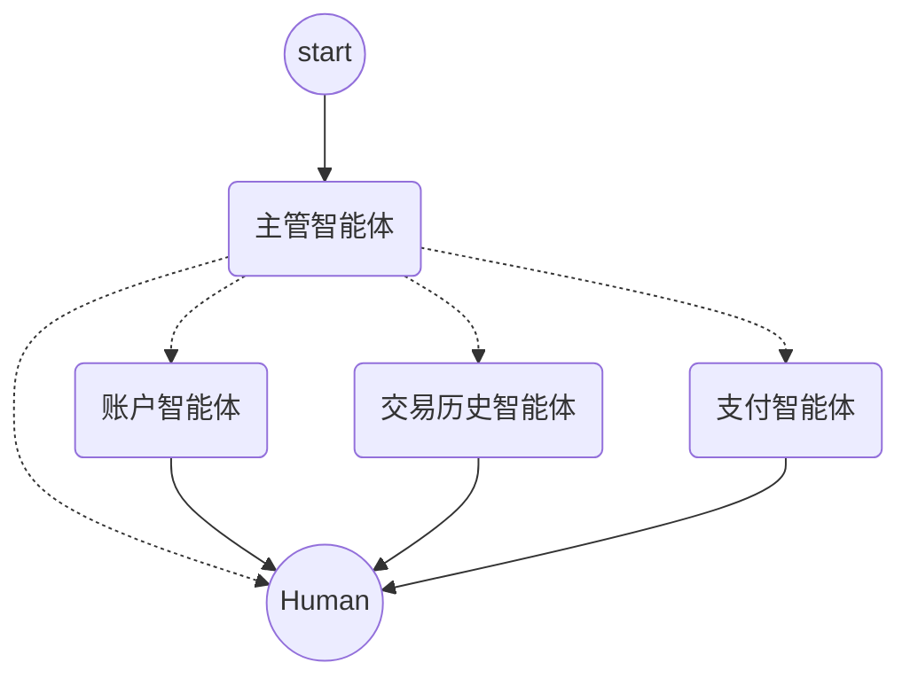

<!-- YAML front-matter schema: https://review.learn.microsoft.com/en-us/help/contribute/samples/process/onboarding?branch=main#supported-metadata-fields-for-readmemd -->
<!-- prettier-ignore -->
<div align="center">


# 使用 Java 与 [Langraph4j] 的多智能体银行助手

[](https://codespaces.new/azure-samples/agent-openai-java-banking-assistant?hide_repo_select=true&ref=main&quickstart=true)
[](https://github.com/azure-samples/agent-openai-java-banking-assistant/actions)

[](LICENSE)

<!-- []() -->

:star: 若您喜欢本示例，欢迎在 GitHub 上标星 — 对我们帮助很大！

[概述](#overview) • [架构](#architecture) • [快速开始](#getting-started) • [资料](#resources) • [常见问题](#faq) • [疑难解答](#troubleshooting)


</div>


## <span id="overview">概述</span>
本概念验证（PoC）的核心场景是个人银行助手，旨在改变用户与银行账户信息、交易记录及支付功能交互的方式。在多智能体架构中运用生成式 AI，通过自然对话界面，让用户便捷地访问与管理金融数据。

用户无需在传统网页与菜单间跳转，只需与 AI 助手对话，即可查询余额、查看近期交易或发起付款。这种方式使理财更直观、易用；同时基于既有工作负载数据与 API，保证服务可靠、安全。

`data` 文件夹中提供了发票样例，便于体验支付功能。配备 OCR 工具（Azure 文档智能）的支付智能体会引导对话，提取发票数据并启动支付流程。另有交易、支付方式与余额等模拟账户数据可供查询。所有数据与服务均通过外部 REST API 及智能体消费的 [**MCP 工具**][MCP] 对外提供。

## <span id="features">功能</span>
本项目提供以下功能与技术模式：
 - 在 Azure OpenAI 上使用 **gpt-4o-mini** 或 **gpt-4o** 的简单多智能体主管架构。
 - 通过 [spring-ai-mcp](https://docs.spring.io/spring-ai/reference/api/mcp/mcp-overview.html) 将业务 API 暴露为智能体可用的 [MCP] 工具。
 - 使用 [Langchain4j](https://github.com/langchain4j/langchain4j) 配置智能体工具并自动调用工具。
 - 使用 [Langgraph4j](https://github.com/bsorrentino/langgraph4j/) 实现多智能体主管工作流管理。
 - 基于聊天的会话界面为 [React 单页应用](https://react.fluentui.dev/?path=/docs/concepts-introduction--docs)，支持上传图片。支持的图片为发票、收据、账单等 jpeg/png，供虚拟银行助手代您付款。
 - 使用 Azure 文档智能的 [预建发票](https://learn.microsoft.com/en-us/azure/ai-services/document-intelligence/concept-invoice?view=doc-intel-4.0.0) 模型进行票据扫描与数据提取。
 - 在部署于 [Azure 容器应用](https://azure.microsoft.com/en-us/products/container-apps) 的现有业务微服务旁，并联部署副驾（Copilot）应用。
 - 借助 [Azure Developer CLI](https://learn.microsoft.com/en-us/azure/developer/azure-developer-cli/) 自动创建 Azure 资源并部署解决方案。

### <span id="architecture">架构</span>


### Langgraph4j 多智能体主管工作流




个人银行助手采用[垂直多智能体系统](./docs/multi-agents/introduction.md)设计，各智能体专注于特定领域（如账户管理、交易历史、支付）。架构包含以下主要组件：

- **Copilot 助手应用（微服务）**：作为处理用户请求的中心枢纽。该 Spring Boot 应用实现垂直多智能体架构：用 [Langgraph4j](https://github.com/bsorrentino/langgraph4j) 定义与管理智能体工作流，用 [Langchain4j](https://github.com/langchain4j/langchain4j) 创建配备工具的智能体。
主管智能体根据聊天理解用户意图，并将请求路由到对应领域智能体。
    - **Supervisor Agent（主管智能体）**：作为用户代理，根据聊天输入理解意图并定向到具体领域智能体，确保问题由相关智能体高效处理。主管在每轮对话中只启用一个智能体来回应用户任务，仅做路由；假定领域智能体能一次完成任务，或在需要用户补充信息或确认操作（如提交付款）时再与用户交互。
    
    - **Account Agent（账户智能体）**：处理与银行账户信息、可用额度、已登记支付方式相关的任务，通过账户服务 API 获取与管理账户数据。

    - **Transactions Agent（交易智能体）**：专注于查询用户银行流水，包括收入与支出。该智能体访问账户 API 获取 accountId，并调用交易历史服务检索交易记录并展示给用户。

    - **Payments Agent（支付智能体）**：负责提交付款类任务，与多种 API 与工具交互，例如 ScanInvoice（基于 Azure 文档智能）、账户服务（获取账户与支付方式）、支付服务（提交支付处理）以及交易历史服务（核对是否已支付过某张发票）。

- **既有业务 API**：对接后端系统，执行个人账户、交易与发票支付等操作。这些 API 以独立 Spring Boot 微服务实现，为智能体提供数据与能力；既以传统 REST 形式暴露，也以 [MCP] 工具形式供智能体调用。
    - **Account Service（账户微服务）**：支持按用户名查询账户详情、获取支付方式、查询登记受益人等，三个领域智能体均会用到。

    - **Payments Service（支付微服务）**：支持提交付款与通知交易，是支付智能体高效执行支付任务的关键。

    - **Reporting Service（报表微服务）**：支持按条件搜索交易及按收款方查询交易，为交易智能体提供明细报表；支付智能体也需要用它核对某张发票是否已付过款。

## <span id="getting-started">快速开始</span>

### 在 GitHub Codespaces 或 VS Code Dev Containers 中运行

您可通过 GitHub Codespaces 或 VS Code Dev Containers 在云端/容器内运行本仓库。点击下方任一按钮在对应环境中打开本仓库。

[](https://codespaces.new/azure-samples/agent-openai-java-banking-assistant?hide_repo_select=true&ref=main&quickstart=true)
[](https://vscode.dev/redirect?url=vscode://ms-vscode-remote.remote-containers/cloneInVolume?url=https://github.com/azure-samples/agent-openai-java-banking-assistant/)

容器内已预装全部依赖。可直接跳至[从零开始](#starting-from-scratch)一节。

### 先决条件

* [Java 17](https://learn.microsoft.com/en-us/java/openjdk/download#openjdk-17)
* [Maven 3.8.x](https://maven.apache.org/download.cgi)
* [Azure Developer CLI](https://aka.ms/azure-dev/install)
* [Node.js](https://nodejs.org/en/download/)
* [Git](https://git-scm.com/downloads)
* [Powershell 7+ (pwsh)](https://github.com/powershell/powershell) — 仅限 Windows。
  * **注意**：请在 PowerShell 中能正常执行 `pwsh.exe`。若失败，通常需要升级 PowerShell。


> [!WARNING]
> Azure 订阅账户须具备 `Microsoft.Authorization/roleAssignments/write` 权限，例如[用户访问管理员](https://learn.microsoft.com/azure/role-based-access-control/built-in-roles#user-access-administrator)或[所有者](https://learn.microsoft.com/azure/role-based-access-control/built-in-roles#owner)。  

### <span id="starting-from-scratch">从零开始</span>

可克隆本仓库并进入仓库根目录，或执行 `azd init -t Azure-Samples/agent-openai-java-banking-assistant`。

在本地准备好项目后，若尚无既有 Azure 服务且希望全新部署，请依次执行：

1. 执行 

    ```shell
    azd auth login
    ```

2. 执行 

    ```shell
    azd up
    ```
    
    * 将创建 Azure 资源并将本示例部署到这些资源。
    * 本项目在 **eastus**（默认）、**swedencentral** 等区域的 gpt4-o-mini 模型上测试通过。区域与模型最新列表见[此处](https://learn.microsoft.com/en-us/azure/ai-services/openai/concepts/models)。
    * 使用 Azure 文档智能新版 REST API，当前可用区域：**eastus**（默认）、**westus2**、**westeurope**。详见[此处](https://learn.microsoft.com/en-us/azure/ai-services/document-intelligence/sdk-overview-v4-0?view=doc-intel-4.0.0&tabs=csharp)。

3. 部署成功后，控制台会打印 Web 应用 URL，在浏览器中打开即可使用。

示意如下：


### 使用既有 Azure 资源部署

若已有 Azure 资源，可通过设置 `azd` 环境变量复用。

#### 既有资源组

1. 执行 `azd env set AZURE_RESOURCE_GROUP {现有资源组名称}`
2. 执行 `azd env set AZURE_LOCATION {现有资源组所在区域，如 eastus2}`

#### 既有 OpenAI 资源

1. 执行 `azd env set AZURE_OPENAI_SERVICE {现有 OpenAI 服务名称}`
2. 执行 `azd env set AZURE_OPENAI_RESOURCE_GROUP {OpenAI 服务所在资源组名称}`
3. 执行 `azd env set AZURE_OPENAI_SERVICE_LOCATION {现有资源所在区域，如 eastus2}`。若 OpenAI 与 `azd up` 所选区域不同，则需要设置此项。
4. 执行 `azd env set AZURE_OPENAI_CHATGPT_DEPLOYMENT {现有 ChatGPT 部署名称}`。若部署名不是默认的 `gpt4-o-mini`，则需要设置。

#### 既有 Azure 文档智能

1. 执行 `azd env set AZURE_DOCUMENT_INTELLIGENCE_SERVICE {现有 Azure 文档智能服务名称}`
2. 执行 `azd env set AZURE_DOCUMENT_INTELLIGENCE_RESOURCE_GROUP {包含该服务的资源组名称}`
3. 若该资源组与 `azd up` 将选区域不同，再执行 `azd env set AZURE_DOCUMENT_INTELLIGENCE_RESOURCE_GROUP_LOCATION {该服务所在区域}`

#### 其他既有 Azure 资源

也可复用既有表单识别器与存储账户等。需向 `azd env set` 传入的环境变量列表见 `./infra/main.parameters.json`。

#### 创建其余资源

现在可执行 `azd up`，步骤与上文[从零开始](#starting-from-scratch)相同，将同时完成资源创建与代码部署。


### 重新部署

若仅修改了 `app` 文件夹内的前后端代码，无需重新创建 Azure 资源，只需执行：

```shell
azd deploy
```

若修改了基础设施（`infra` 文件夹或 `azure.yaml`），需要重新预配资源，可执行：

```shell
azd up
```
 > [!WARNING]
 > 多次执行 `azd up` 重新部署基础设施时，请在 `infra/main.parameters.json` 中将下列参数设为 `true`，以免容器应用镜像被默认的 `mcr.microsoft.com/azuredocs/containerapps-helloworld` 覆盖：

```json
 "copilotAppExists": {
      "value": false
    },
    "webAppExists": {
      "value": false
    },
    "accountAppExists": {
      "value": false
    },
    "paymentAppExists": {
      "value": false
    },
    "transactionAppExists": {
      "value": false
    }
```

### 本地运行

1. 执行

    ```shell
    az login
    ```

2. 进入 `app` 目录

    ```shell
    cd app
    ```

3. 运行 `./start-compose.ps1`（Windows）或 `./start-compose.sh`（Linux/Mac），或在 VS Code 中运行任务 “Start App”，在本地启动项目。
4. 等待 docker compose 启动所有容器（web、api、indexer 等），刷新浏览器访问 [http://localhost](http://localhost)


## <span id="guidance">使用说明</span>

### 试用不同 gpt4 模型与版本
本项目默认 LLM 为 *gpt-4o-mini*：成本较低的小型模型，具备较强的规划与推理能力，便于根据对话选择正确智能体并可靠调用工具。但在长对话或部分措辞下，模型偶发无法准确识别意图（尤其在上传图片要求代付账单时）。测试中 *gpt-4o* 效果更好，但更贵、更慢。模型与定价详见[此处](https://azure.microsoft.com/en-us/pricing/details/cognitive-services/openai-service/)。

可将 `AZURE_OPENAI_CHATGPT_MODEL`、`AZURE_OPENAI_CHATGPT_VERSION`、`AZURE_OPENAI_CHATGPT_DEPLOYMENT` 环境变量改为目标模型，例如：

```shell
azd env set AZURE_OPENAI_CHATGPT_MODEL gpt-4o
azd env set AZURE_OPENAI_CHATGPT_VERSION 2024-05-13
azd env set AZURE_OPENAI_CHATGPT_DEPLOYMENT gpt-4o
```
### 启用 Application Insights

默认已启用 Application Insights，可查看每个请求的追踪与错误日志。

若需禁用，在运行 `azd up` 前将 `AZURE_USE_APPLICATION_INSIGHTS` 设为 false：

1. 执行 `azd env set AZURE_USE_APPLICATION_INSIGHTS false`
1. 执行 `azd up`

查看性能数据：在资源组中打开 Application Insights 资源，进入 “调查 → 性能”，选择任意 HTTP 请求查看耗时。
分析聊天请求性能：使用 “深入分析示例” 查看单次聊天触发的端到端 API 调用追踪。
在 “跟踪和事件” 面板可查看自定义 Java 信息日志，便于理解 OpenAI 请求与响应内容。


查看异常与服务器错误：进入 “调查 → 失败”，用筛选定位具体异常；右侧可查看 Java 堆栈。

### 启用身份验证

默认情况下，部署在 ACA 上的 Web 应用不启用身份验证与访问限制，任何能路由到该应用的人都可以使用个人助手。可按 [添加应用身份验证](https://learn.microsoft.com/en-us/azure/container-apps/authentication) 教程，对接到 Microsoft Entra，为已部署的 Web 应用启用登录要求。


若需仅限特定用户或组访问，可参考[将 Microsoft Entra 应用限制为特定用户集](https://learn.microsoft.com/entra/identity-platform/howto-restrict-your-app-to-a-set-of-users)：在企业应用程序中将 “需要分配？” 设为是，再分配用户/组。未获授权的用户将收到错误 AADSTS50105：管理员已将应用程序 <app_name> 配置为阻止用户访问。

### 使用 GitHub Actions 的应用持续集成

1. **为 GitHub Action 管道创建服务主体**

    使用 [az ad sp create-for-rbac](https://learn.microsoft.com/en-us/cli/azure/ad/sp#az_ad_sp_create_for_rbac) 创建服务主体：
    
    ```bash
    groupId=$(az group show --name <resource-group-name>  --query id --output tsv)
    az ad sp create-for-rbac --name "agent-openai-java-banking-assistant-pipeline-spi" --role contributor --scope $groupId --sdk-auth
    ```
    输出类似：
    
    ```json
    {
    "clientId": "xxxx6ddc-xxxx-xxxx-xxx-ef78a99dxxxx",
    "clientSecret": "xxxx79dc-xxxx-xxxx-xxxx-aaaaaec5xxxx",
    "subscriptionId": "xxxx251c-xxxx-xxxx-xxxx-bf99a306xxxx",
    "tenantId": "xxxx88bf-xxxx-xxxx-xxxx-2d7cd011xxxx",
    "activeDirectoryEndpointUrl": "https://login.microsoftonline.com",
    "resourceManagerEndpointUrl": "https://management.azure.com/",
    "activeDirectoryGraphResourceId": "https://graph.windows.net/",
    "sqlManagementEndpointUrl": "https://management.core.windows.net:8443/",
    "galleryEndpointUrl": "https://gallery.azure.com/",
    "managementEndpointUrl": "https://management.core.windows.net"
    } 
    ```
    
    请保存完整 JSON，后续步骤会用到。并记下 clientId，下一节更新服务主体时需要。

2. **为服务主体分配 ACRPush 权限**
   
   此步骤使 GitHub 工作流能以该服务主体[登录容器注册表](https://learn.microsoft.com/en-us/azure/container-registry/container-registry-auth-service-principal)并推送 Docker 镜像。
   获取容器注册表资源 ID，将下列命令中的注册表名替换为您的注册表名：
   ```bash
   registryId=$(az acr show --name <registry-name> --resource-group <resource-group-name> --query id --output tsv)
    ```

   使用 [az role assignment create](https://learn.microsoft.com/en-us/cli/azure/role/assignment#az_role_assignment_create) 分配 AcrPush 角色（推送与拉取）。将服务主体的客户端 ID 代入：
   ```bash
   az role assignment create --assignee <ClientId> --scope $registryId --role AcrPush
   ```

3. **将服务主体加入 GitHub 环境密钥**

 - 在 GitHub 上打开您 fork 的仓库，创建名为 `Development` 的[环境](https://docs.github.com/en/actions/deployment/targeting-different-environments/using-environments-for-deployment)（名称须完全一致，勿改）。若要更改环境名称或分支映射，请同步修改 `.github/workflows/azure-dev.yml` 中的管道配置。
 - 在 `Development` 环境中创建如下[密钥](https://docs.github.com/en/actions/security-guides/encrypted-secrets#creating-encrypted-secrets-for-a-repository)：
    | 密钥                    | 取值                                                                                       |
    |-----------------------|--------------------------------------------------------------------------------------------|
    | AZURE_CREDENTIALS     | 创建服务主体时输出的完整 JSON                                                            |
    | SPI_CLIENT_ID         | 服务主体客户端 ID，用作登录 Azure 容器注册表的用户名                                      |
    | SPI_CLIENT_SECRET     | 服务主体客户端密钥，用作登录 Azure 容器注册表的密码                                      |
 - 在 `Development` 环境中创建如下[环境变量](https://docs.github.com/en/actions/learn-github-actions/variables#creating-configuration-variables-for-an-environment)：
    | 变量                    | 取值                                                                                       |
    |---------------------------|--------------------------------------------------------------------------------------------|
    | ACR_NAME                  | Azure 容器注册表名称                                                                       |
    | RESOURCE_GROUP            | Azure 容器环境所在资源组名称                                                               |
 - 在仓库中创建如下[仓库变量](https://docs.github.com/en/actions/writing-workflows/choosing-what-your-workflow-does/store-information-in-variables#creating-configuration-variables-for-a-repository)：
    | 变量                    | 取值                                                                                       |
    |---------------------------|--------------------------------------------------------------------------------------------|
    | ACA_DEV_ENV_NAME                  | Azure 容器应用环境名称                                                                 |
    | COPILOT_ACA_DEV_APP_NAME      | 副驾编排器容器应用名称                                                                        |
    | WEB_ACA_DEV_APP_NAME          | Web 前端容器应用名称                                                                        |
    | ACCOUNTS_ACA_DEV_APP_NAME     | 业务账户 API 容器应用名称                                                                  |
    | PAYMENTS_ACA_DEV_APP_NAME     | 业务支付 API 容器应用名称                                                                  |
    | TRANSACTIONS_ACA_DEV_APP_NAME | 业务交易 API 容器应用名称                                                                  |


### 成本估算

定价因区域与用量而异，无法给出您环境下的精确金额。
可对下列资源使用 [Azure 定价计算器](https://azure.com/e/8ffbe5b1919c4c72aed89b022294df76) 估算。

- Azure 容器应用：消耗型工作负载配置文件，4 vCPU、8 GB 内存，按 vCPU 与内存计费。[定价](https://azure.microsoft.com/en-us/pricing/details/container-apps/)
- Azure OpenAI：标准层，ChatGPT 与 Ada 等模型，按每 1K token 计费，每个问题至少约 1K token。[定价](https://azure.microsoft.com/en-us/pricing/details/cognitive-services/openai-service/)
- Azure 文档智能：SO（标准）层，预建版式。[定价](https://azure.microsoft.com/pricing/details/form-recognizer/)

- Azure Blob 存储：标准层，ZRS（区域冗余存储），按存储与读操作计费。[定价](https://azure.microsoft.com/pricing/details/storage/blobs/)
- Azure Monitor：即用即付，按采集数据量计费。[定价](https://azure.microsoft.com/pricing/details/monitor/)

ACA 每月免费提供前 180,000 vCPU·秒、360,000 GiB·秒与 200 万次请求。若要降低成本，可修改 `infra` 下参数文件改用文档智能免费 SKU；需注意限制，例如免费资源仅分析每份文档前 2 页。

⚠️ 为避免产生不必要费用，应用不再使用时请删除或运行 `azd down`，或在门户中删除资源组。


## <span id="resources">资料</span>

进一步了解本示例中的多智能体架构与相关技术，可参考：

- [适用于 Java 的 LangGraph：用 LLM 构建有状态、多参与者应用的库][Langgraph4j]
- [生成式 AI 入门](https://github.com/microsoft/generative-ai-for-beginners)
- [Azure OpenAI 服务](https://learn.microsoft.com/azure/ai-services/openai/overview)
- [OpenAI 对认知架构的押注](https://blog.langchain.dev/openais-bet-on-a-cognitive-architecture/)
- [推理、规划与工具调用的新兴 AI 智能体架构综述](https://arxiv.org/pdf/2404.11584)
- [MicroAgents：以微服务探索智能体架构](https://devblogs.microsoft.com/semantic-kernel/microagents-exploring-agentic-architecture-with-microservices/)
- [Azure OpenAI 与 Azure AI 搜索实现聊天 + 企业数据](https://github.com/Azure-Samples/azure-search-openai-java)
- [SK Agents 概述与高层设计（.NET）](https://github.com/microsoft/semantic-kernel/blob/ec26ce7cb70f933b52a62f0a4e1c7b98c49d590e/docs/decisions/0032-agents.md#usage-patterns)

更多 Azure AI 示例见 [azureai-samples](https://github.com/Azure-Samples/azureai-samples)。

## <span id="faq">常见问题</span>

常见问题解答见 [FAQ](./docs/faq.md)。

## <span id="troubleshooting">疑难解答</span>

运行或部署本示例如遇问题，请先查看[疑难解答指南](./docs/troubleshooting.md)。若仍无法解决，请在本仓库[提交 issue](https://github.com/Azure-Samples/agent-openai-java-banking-assistant/issues)。

## 参与贡献

欢迎对本项目提交贡献与建议。多数贡献需要您签署贡献者许可协议（CLA），声明您有权且实际授予我们使用您贡献的权利。详情见 https://cla.opensource.microsoft.com。

提交拉取请求时，CLA 机器人会自动判断是否需要 CLA，并更新 PR 状态（如检查、评论）。按机器人说明操作即可；在使用我们 CLA 的所有仓库中，通常只需签署一次。

本项目采用 [Microsoft 开源行为准则](https://opensource.microsoft.com/codeofconduct/)。
更多信息见[行为准则常见问题](https://opensource.microsoft.com/codeofconduct/faq/)，或发邮件至 [opencode@microsoft.com](mailto:opencode@microsoft.com)。

## 商标

本项目可能包含项目、产品或服务的商标或标识。使用 Microsoft 商标或标识须遵守
[Microsoft 商标与品牌准则](https://www.microsoft.com/en-us/legal/intellectualproperty/trademarks/usage/general)。
在修改版本中使用 Microsoft 商标或标识不得引起混淆或暗示 Microsoft 赞助。
第三方商标或标识的使用遵循各自政策。


[MCP]: https://modelcontextprotocol.io
[Langchain4j]: https://github.com/langchain4j/langchain4j
[Langraph4j]: https://github.com/bsorrentino/langgraph4j
