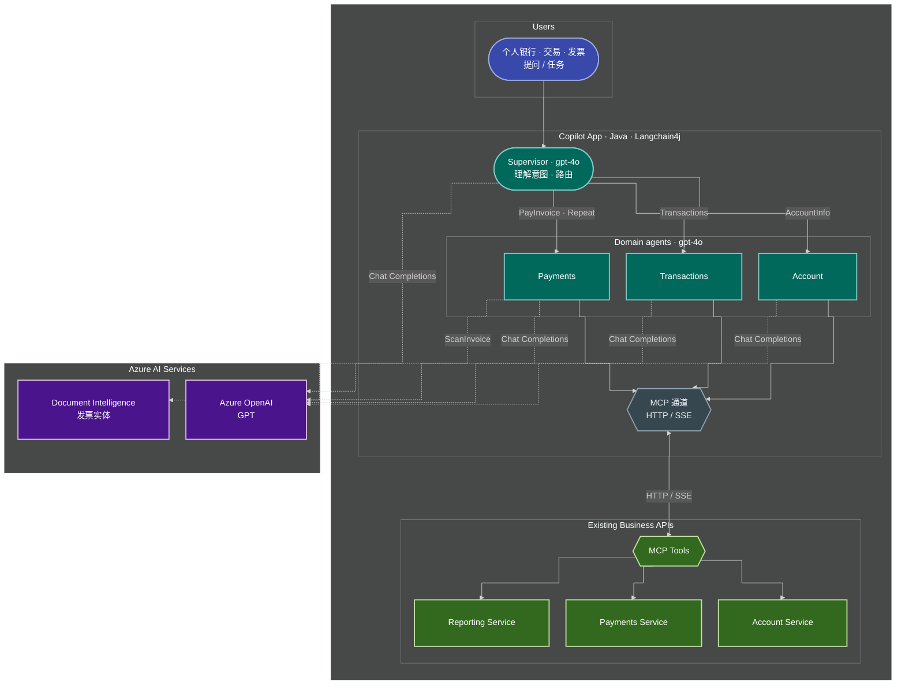

# HLA-MCP 架构图（Mermaid）

与 `assets/HLA-MCP.png` 一致的分层关系，图源便于在 [mermaid.live](https://mermaid.live) 或 VS Code 中预览。

**读图方式：** 上面一条横排是「用户 → Copilot → 业务 API」；虚线向下连 **Azure AI**。具体 MCP 工具名见本文末尾表格。

---

## 总览

> **布局仍乱时：** 可在 `flowchart` 中尝试加入 `"defaultRenderer": "elk"`（需预览器支持，[mermaid.live](https://mermaid.live) 通常可用）。

---

## MCP 工具对照（与图中 API 区块一致）

| 服务 | MCP / 能力 |
|------|------------|
| **Account Service** | `getAccountByUsername`，`getAccountDetails`，`getPaymentMethods`，`getRegisteredBeneficiaries` |
| **Payments Service** | `submitPayment` |
| **Reporting Service** | `notifyTransaction`，`searchTransactions`，`getTransactionByRecipient` |

智能体侧 **API1** 一般指 Account Service；**API2** Payments；**API3** Reporting；**ScanInvoice** 走 Document Intelligence。
